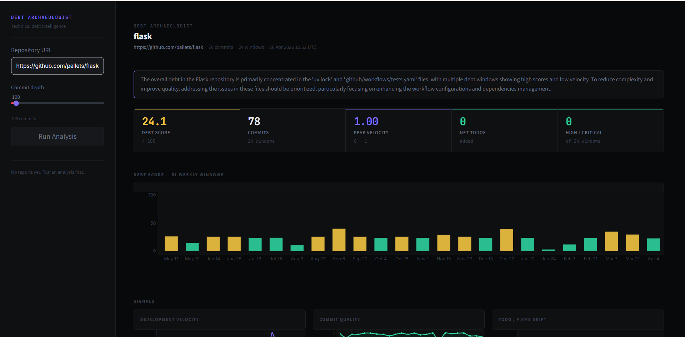
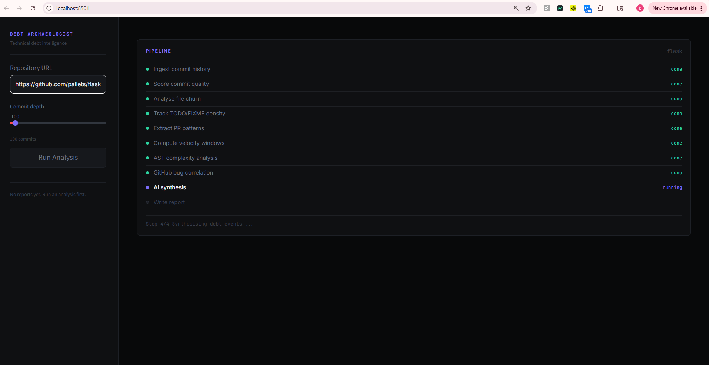
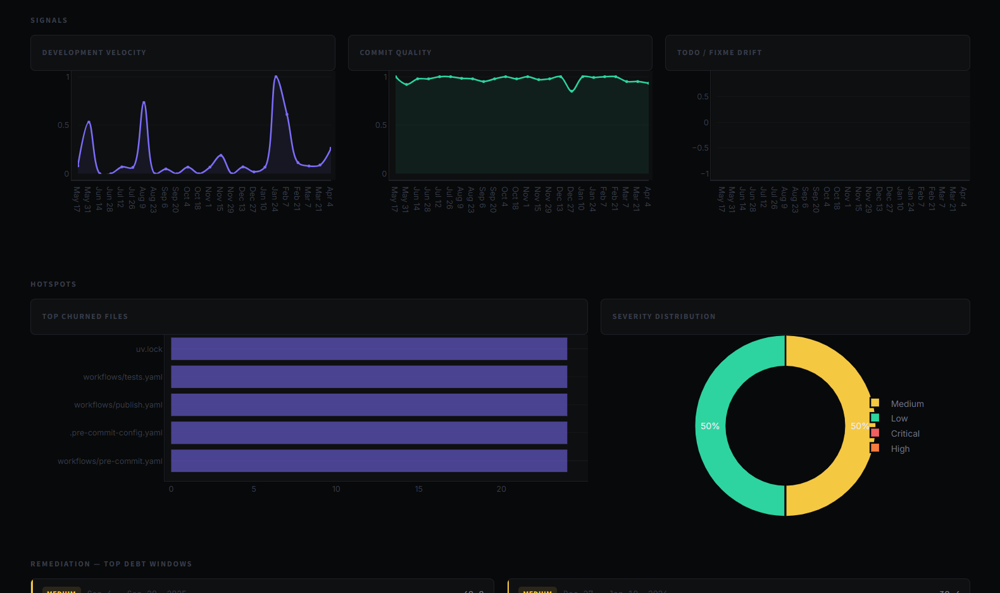
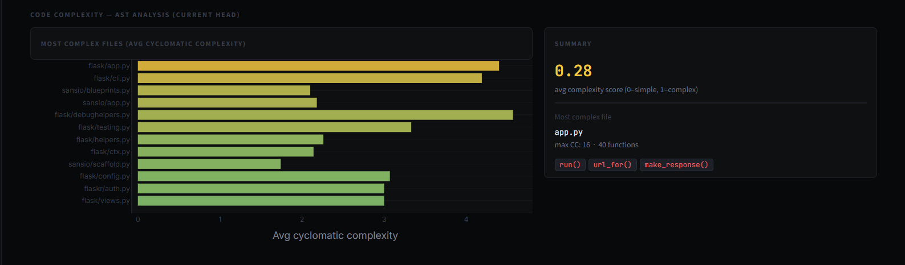

# Debt Archaeologist

> **Technical debt intelligence for engineering teams.**  
> Analyses your entire Git commit history to surface *where* debt accumulated, *why*, and *what to fix* — backed by AST analysis, bug correlation, and AI-generated remediation hints.


---

## What it does

Most debt tools lint your code or count TODOs. Debt Archaeologist does something different — it correlates **commit behaviour**, **code structure**, and **real bug reports** across time to tell you:

- Which two-week periods had the most chaotic development
- Which files are architecturally the most complex right now
- Which engineers introduced the most debt (and how to coach them)
- Whether your high-debt windows actually produced more bugs (validated against GitHub Issues)
- Where your repo sits vs. 60+ reference Python repositories

---

## Screenshots

| Dashboard | Pipeline Progress |
|---|---|
|  |  |

| Signal Breakdown | Code Complexity |
|---|---|
|  |  |

---

## Architecture

```
┌─────────────────────────────────────────────────────────────────┐
│                         main.py                                  │
│                                                                  │
│  Step 1 ─ Ingest                                                 │
│    GitPython clone/pull → CommitRecord[] (diffs, TODO counts)    │
│                                                                  │
│  Step 2 ─ Phase A  [LangGraph parallel fan-out]                  │
│    ┌─────────────┐ ┌──────────┐ ┌────────────┐                  │
│    │CommitQuality│ │FileChurn │ │TodoDensity │                   │
│    └─────────────┘ └──────────┘ └────────────┘                  │
│    ┌─────────────┐ ┌──────────────────────┐                     │
│    │ PRPattern   │ │   VelocityDelta       │                     │
│    └─────────────┘ └──────────────────────┘                     │
│                                                                  │
│  Step 3 ─ Phase B  [Sequential — needs Phase A outputs]          │
│    ┌──────────────────┐  ┌─────────────────────┐                │
│    │ CodeComplexity   │  │  BugCorrelation      │               │
│    │ (AST analysis)   │  │  (GitHub Issues API) │               │
│    └──────────────────┘  └─────────────────────┘                │
│                                                                  │
│  Step 4 ─ Synthesis                                              │
│    Author attribution + Benchmark percentile + GPT-4o-mini hints │
│    → AnalysisResult JSON                                         │
└─────────────────────────────────────────────────────────────────┘
```

---

## Quick Start

### Docker (recommended)

```bash
docker run -e OPENAI_API_KEY=sk-... -p 8501:8501 kushal28101999/debt-archaeologist
```

Open **http://localhost:8501**, enter any public GitHub repo URL, click **Run Analysis**.

### Docker Compose

```bash
git clone https://github.com/kushal28101999/debt-archaeologist.git
cd debt-archaeologist
cp .env.example .env          # add your OpenAI key
docker compose up
```

### Local Development

**Requirements:** Python 3.11+, Git

```bash
git clone https://github.com/kushal28101999/debt-archaeologist.git
cd debt-archaeologist

python -m venv .venv
source .venv/bin/activate      # Windows: .venv\Scripts\activate

pip install -r requirements.txt
cp .env.example .env           # add your OpenAI key

# Run a full analysis
python main.py --repo https://github.com/pallets/flask --max-commits 500

# Launch the dashboard
python -m streamlit run dashboard/app.py
```

---

## Configuration

| Variable | Required | Description |
|---|---|---|
| `OPENAI_API_KEY` | Yes | Used for synthesis only — ~700 tokens per analysis run |

Set in `.env` or pass as an environment variable. The key is **never** committed to git.

**CLI flags:**

```bash
python main.py --repo <url> --max-commits <n> --output <path>
```

| Flag | Default | Description |
|---|---|---|
| `--repo` | django/django | Public Git URL to analyse |
| `--max-commits` | 500 | Number of most-recent commits to process |
| `--output` | `debt_report_<repo>.json` | Output path for the JSON report |

---

## What each agent measures

| Agent | Signal | Method |
|---|---|---|
| **Commit Quality** | Message clarity, commit atomicity | Heuristic scoring (no LLM) |
| **File Churn** | File rewrite frequency and volume | `churn_score = lines × log(1 + commits)` |
| **TODO Density** | Net `TODO/FIXME/HACK/XXX` per window | Actual diff scanning (not message text) |
| **PR Patterns** | Merge commit detection, PR count per window | Commit message regex |
| **Velocity Delta** | Commit frequency × inverse churn | Rolling 14-day windows, normalised 0–1 |
| **Code Complexity** | McCabe cyclomatic complexity, nesting depth | Python AST analysis on current HEAD |
| **Bug Correlation** | Bug reports opened per window | GitHub Issues REST API (no token needed) |

---

## Output

Each analysis produces a `debt_report_<repo>.json` containing:

- `overall_debt_score` — 0–100 composite score
- `benchmark_percentile` — where the repo ranks vs 60+ reference repos
- `debt_events[]` — per-window breakdown (score, severity, remediation hints, bug count)
- `code_complexity[]` — top 20 most complex files with cyclomatic complexity metrics
- `author_records[]` — per-engineer debt contribution scores
- `bug_density[]` — GitHub bug counts matched to time windows
- `executive_summary` — AI-generated 2-sentence summary

---

## Running Tests

```bash
python -m pytest tests/ -v
```

30 unit tests covering all agents and synthesis. Zero network calls, zero LLM calls.

```
tests/test_agents.py::TestCommitQuality    6 passed
tests/test_agents.py::TestFileChurn        4 passed
tests/test_agents.py::TestVelocityDelta    5 passed
tests/test_agents.py::TestTodoDensity      4 passed
tests/test_agents.py::TestPRPattern        5 passed
tests/test_agents.py::TestSynthesis        6 passed
```

---

## CI/CD

GitHub Actions runs on every push and pull request to `main`:

- **Tests** — Python 3.11, 3.12, 3.13
- **Lint** — ruff

See [`.github/workflows/ci.yml`](.github/workflows/ci.yml).

---

## Tech Stack

| Layer | Technology |
|---|---|
| Orchestration | [LangGraph](https://github.com/langchain-ai/langgraph) — parallel agent fan-out |
| Git ingestion | [GitPython](https://gitpython.readthedocs.io) |
| Code analysis | Python `ast` module — McCabe complexity |
| AI synthesis | OpenAI `gpt-4o-mini` — ~700 tokens per run |
| Data models | [Pydantic v2](https://docs.pydantic.dev) |
| Dashboard | [Streamlit](https://streamlit.io) + [Plotly](https://plotly.com) |
| Containerisation | Docker + Docker Compose |

---

## Roadmap

- [ ] JavaScript / TypeScript AST support
- [ ] Semantic code analysis (coupling, dead code detection)
- [ ] Historical complexity tracking (not just current HEAD)
- [ ] REST API backend (FastAPI) for CI/CD integration
- [ ] GitHub App for per-PR debt scoring

---

## License

MIT — see [LICENSE](LICENSE).

---

<p align="center">Built by <a href="https://github.com/kushal28101999">Kushal</a></p>
